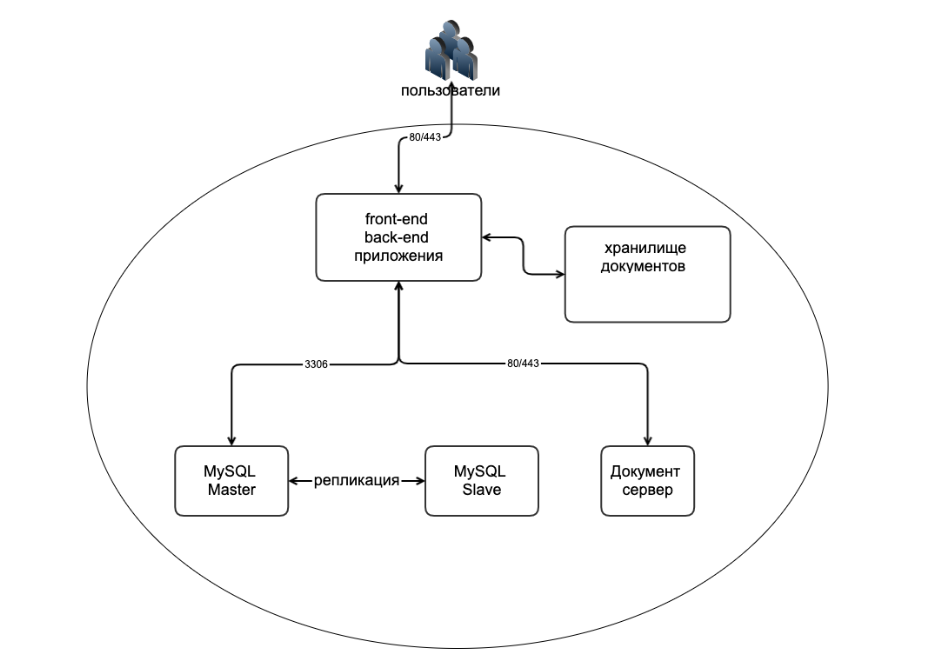

# r7-office middle
 

В этой статье рассмотрим установку программного продукта Р7 Сервер Базовый в архитектуре Middle используя  ansible  на операционных системах Linux( Redos 7.3.3, Centos 7) 

# Требования

Операционная система Centos 7 или Redos 7.3.3 

<details>
  <summary>Для корпоративного сервера</summary>

- Процессор: рекомендуется от 6 ядер 
- Оперативная память: рекомендуется от 12 Гб 
- Свободное место на жестком диске: рекомендуется от 50 Гб 
</details>

<details>
  <summary>Для документ сервера</summary>
  
- Процессор: рекомендуется от 4 ядер 
- Оперативная память: рекомендуется от 8 Гб 
- Свободное место на жестком диске: рекомендуется от 50 Гб 
</details>

<details>
  <summary>Для базы данных mysql</summary>
  
- Процессор: рекомендуется от 2 ядер 
- Оперативная память: рекомендуется от 2 Гб 
- Свободное место на жестком диске: рекомендуется от 15 Гб 
- Python version 3.*
</details>


# Перед тем как запустить
Для запуска скрипта необходимо заполнить переменные которые находятся:
- inventory/hosts
- inventory/group_vars/all/main.yml 
## 1. Заполняем переменные в inventory/hosts 
 ```
[cs]
cs_1 ansible_host=192.168.1.1 ansible_port=22 ansible_user=ssh_user
[ds]
ds_node ansible_host=192.168.1.2 ansible_port=22 ansible_user=ssh_user
[master_db]
master_node ansible_host=192.168.1.3 ansible_port=22 ansible_user=ssh_user
[slave_db]
slave_node ansible_host=192.168.1.4 ansible_port=22 ansible_user=ssh_user
```

### Переменные  hosts
| vars | description |
|-------|-------------|
| cs_1 | хост, на котором будет установлен корпоративный сервер (оставляем по умолчанию) |
| ds_node | хост, на котором будет установлен документ сервер (оставляем по умолчанию)|
| master_node | хост, на котором будет установлена база данных mysql master (оставляем по умолчанию) |
| slave_node | хост, на котором будет установлена база данных mysql svale (оставляем по умолчанию)|
|ansible_host|ip адрес хоста |
|ansible_port|порт для подключения через ssh ( по умолчанию 22)|
|ansible_user|пользователь для подключения по ssh|


## 2. Заполняем переменные в inventory/group_vars/all/main.yml
```
cs: "{{ hostvars[groups['cs'][0]].ansible_host }}" 
ds: "{{ hostvars[groups['ds'][0]].ansible_host }}"  
ms: "{{ hostvars[groups['slave_db'][0]].ansible_host }}" 
mm: "{{ hostvars[groups['master_db'][0]].ansible_host }}"

mysql_root_db_pass: "<password>"
mysql_root_db_user: root
mysql_repl_user:
  - name: repl
    pass: "<password>"
    host: "<host>"
    priv: "*.*:REPLICATION SLAVE"
mysql_cs_repl:
  - name: cs_user
    pass: "<password>"
    priv: "*.*:ALL"
    host: "<host>"
    db_host: "{{ hostvars[groups['master_db'][0]].ansible_host }}"
DS_password: <password>
DS_db_psql: r7office
DS_psql_user: r7office
DS_psql_pass: r7office
```
### Переменные group_vars

| vars | description |
|-------|-------------|
|cs | ip адрес хоста для корпоративного сервера. Берет значение  ansible_host  из файла inventory/hosts|
| ds| ip адрес хоста для документ сервера. Берет значение  ansible_host  из файла inventory/hosts|
|ms | ip адрес хоста для базы данных (Master). Берет значение  ansible_host  из файла inventory/hosts|
|mm |ip адрес хоста для базы данных (Slave). Берет значение  ansible_host  из файла inventory/hosts |
|mysql_root_db_pass | пароль от пользователя root для входа в mysql|
|mysql_root_db_user | пользователь для входа в mysql  |
| mysql_repl_user| переменные для настройки mysql Master с mysql Slave.<br> name - имя пользователя <br>pass - пароль от пользователя <br> host - ip адрес , с которого разрешен вход под данным пользователем ( если указать % то доступ будет разрешен с любого ip) <br> priv- привелегии пользователя|
|mysql_cs_repl | переменные для интеграции корпоративного сервера с Mysql базой .<br> name - имя пользователя <br>pass - пароль от пользователя <br> priv- привелегии пользователя <br> host - ip адрес , с которого разрешен вход под данным пользователем ( если указать % то доступ будет разрешен с любого ip) |
|DS_password| пароль для интеграции документ сервера с корпоративным сервером |
|DS_db_psql | имя базы данных для документ сервера |
|DS_psql_user | имя пользователя для базы данных документ сервера|
|DS_psql_pass | пароль для базы данных документ сервера|
 
## Лицензирование Документ сервера
Если у вас есть лицензия для документ сервера, ее необходимо переместить в папку roles/ds/templates/license.lic
## 3. Запуск плейбука
```
ANSIBLE_HOST_KEY_CHECKING=False ansible-playbook -i inventory/hosts cs.yml 
```
